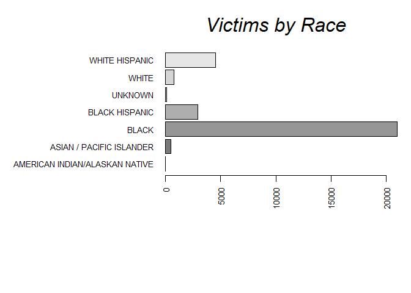
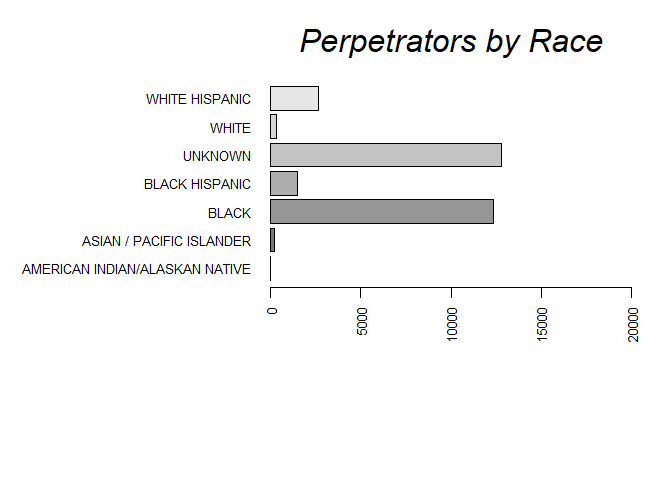
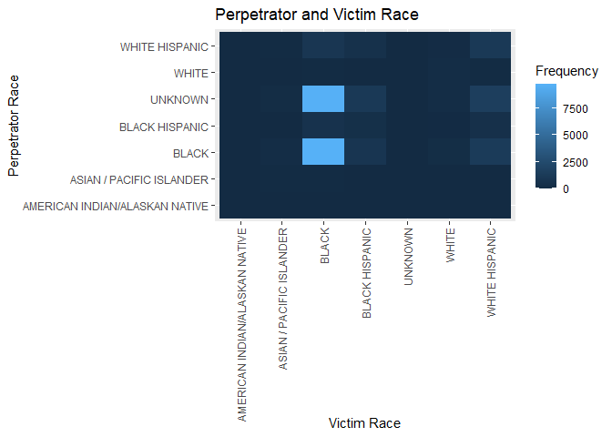
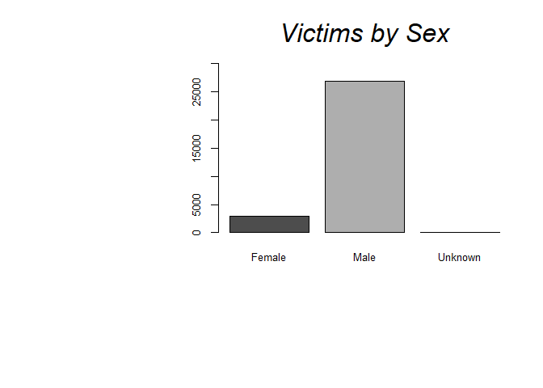
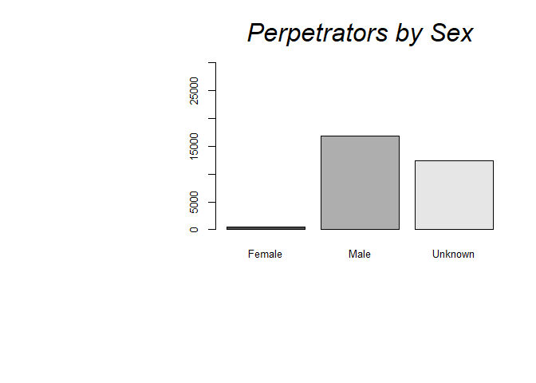
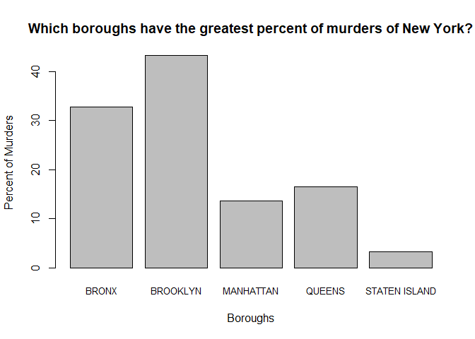

NYPD Shooting Incident Data (Historic)
================
David Lord
2024-02-09

- [Import Data from City of New
  York](#import-data-from-city-of-new-york)
- [Read in Data and select fields that will be relevant to
  race:](#read-in-data-and-select-fields-that-will-be-relevant-to-race)
- [Change Columns and Convert Date
  type:](#change-columns-and-convert-date-type)
- [Data cleaning and standardizing](#data-cleaning-and-standardizing)
- [Summary of the Data](#summary-of-the-data)
- [Does an individual’s race play a
  role?](#does-an-individuals-race-play-a-role)
- [Is there a connection between Victim’s and Perpetrator’s
  race?](#is-there-a-connection-between-victims-and-perpetrators-race)
- [Does an individual’s sex play a
  role?](#does-an-individuals-sex-play-a-role)
- [Which Boros has the highest murder
  rate?](#which-boros-has-the-highest-murder-rate)
- [Sources of Bias](#sources-of-bias)

Data was inputted from dataset titled NYPD Shooting Incident Data
(Historic).

This report will analyse the Historic NYPD Shooting Incident Data
self-reported by the NYPD from 2006 to 2022.

**Problem Statement**: Are individuals who identify as Black
disproportionately more susceptible to becoming victims of crime in New
York? Are there any other demographic groups similarly affected?

**Summary**: My analysis revealed that **70%** of crime had victims that
identified as Black, despite comprising only **20%** of the population.
Additionally, I found that **90%** of victims were male, while males
constitute only **47%** of the population.

### Import Data from City of New York

``` r
## Get Current Data
url_in<-"https://data.cityofnewyork.us/api/views/833y-fsy8/rows.csv"
```

### Read in Data and select fields that will be relevant to race:

``` r
nypd<-read.csv(url_in, stringsAsFactors = TRUE) %>%
  select(-c(X_COORD_CD:Lon_Lat, OCCUR_TIME, INCIDENT_KEY, LOC_OF_OCCUR_DESC,LOC_CLASSFCTN_DESC,JURISDICTION_CODE,LOCATION_DESC))
```

### Change Columns and Convert Date type:

``` r
nypd <- nypd %>% 
    rename("Date" = "OCCUR_DATE" ,
          # "Time" = "OCCUR_TIME" ,
           "Murder" = "STATISTICAL_MURDER_FLAG" ,
           "Victim_Sex" = "VIC_SEX" ,
           "Victim_Race" = "VIC_RACE",
           "Victim_Age_Group"="VIC_AGE_GROUP") 
colnames(nypd) <- tolower(colnames(nypd))
#Convert string dates into date type
nypd$date<-mdy(nypd$date)
```

### Data cleaning and standardizing

In cases where the fields were “UNKNOWN” or null, the fields were
converted to “UNKNOWN” or “U” This resulted in a large number of
UNKNOWNS in the data set. However it should not be excluded initially
without keeping in mind how it may make the rest of the data appear.

``` r
#Data cleaning and standardizing
nypd$perp_race[is.na(nypd$perp_race)] <- "UNKNOWN"
nypd$perp_race[(nypd$perp_race=="(null)")] <- "UNKNOWN"
nypd$perp_age_group[(nypd$perp_age_group=="(null)")] <- "UNKNOWN"
nypd$perp_sex[is.na(nypd$perp_sex)] <- "U"
nypd$perp_sex[nypd$perp_sex=='(null)'] <- "U"
nypd$perp_age_group[is.na(nypd$perp_age_group)] <- "UNKNOWN"
nypd$victim_age_group[nypd$victim_age_group=='1022'] <- "UNKNOWN"
```

### Summary of the Data

``` r
#Cleaned
summary(nypd)
```

    ##       date                       boro          precinct        murder     
    ##  Min.   :2006-01-01   BRONX        : 8834   Min.   :  1.00   false:23979  
    ##  1st Qu.:2009-10-29   BROOKLYN     :11685   1st Qu.: 44.00   true : 5765  
    ##  Median :2014-03-25   MANHATTAN    : 3977   Median : 67.00                
    ##  Mean   :2014-10-31   QUEENS       : 4426   Mean   : 65.23                
    ##  3rd Qu.:2020-06-29   STATEN ISLAND:  822   3rd Qu.: 81.00                
    ##  Max.   :2024-12-31                         Max.   :123.00                
    ##                                                                           
    ##  perp_age_group   perp_sex              perp_race     victim_age_group
    ##         :9344         : 9310   BLACK         :12323   <18    : 3081   
    ##  18-24  :6630   (null):    0                 : 9310   1022   :    0   
    ##  25-44  :6342   F     :  461   UNKNOWN       : 3466   18-24  :10677   
    ##  UNKNOWN:4776   M     :16845   WHITE HISPANIC: 2667   25-44  :13563   
    ##  <18    :1805   U     : 3128   BLACK HISPANIC: 1487   45-64  : 2118   
    ##  45-64  : 775                  WHITE         :  305   65+    :  236   
    ##  (Other):  72                  (Other)       :  186   UNKNOWN:   69   
    ##  victim_sex                         victim_race   
    ##  F: 2891    AMERICAN INDIAN/ALASKAN NATIVE:   13  
    ##  M:26841    ASIAN / PACIFIC ISLANDER      :  478  
    ##  U:   12    BLACK                         :20999  
    ##             BLACK HISPANIC                : 2930  
    ##             UNKNOWN                       :   72  
    ##             WHITE                         :  741  
    ##             WHITE HISPANIC                : 4511

### Does an individual’s race play a role?

In order to investigate my first task, I looked at the victim’s race and
the perpetrator’s race from the data and graphed the number of
instances.

<!-- --><!-- -->

People who identified as Black are much more affected by any other
category. **70%** of the crime had victims that identified as Black,
despite comprising only **20%** of the population. Interesting, the
majority of perpetrators’ race was identified as Black or Unknown. This
is a call to action to improve the identification of race and
record-keeping.

### Is there a connection between Victim’s and Perpetrator’s race?

<!-- -->

There seems to be a strong correlation between attacks on Black victims
by perpetrators whose race was identified as Black or is not known. I
will report my findings and hope to bring awareness of this issue. I
would also like to gather more information on how the data is reported
as it could be that the police are not called as often racial
disturbances.

### Does an individual’s sex play a role?

In order to investigate my second task, I looked at the victim’s sex and
the perpetrator’s sex from the data and graphed the number of instances.

<!-- --><!-- -->

I found that **90%** of victims were male, while males constitute only
**47%** of the population. Again, there is an issue with recording
incomplete information of the perpetrators, which hopefully can be
improved on in future.

### Which Boros has the highest murder rate?

My investigation naturally lead to inquiry on where are the crimes
occurring? Does it occur in all boroughs equally or are some more
effected than others? I looked at the number of murders in New York and
found the percentages of murders for each borough.

<!-- -->

Brooklyn has the greatest proportion of murders that occurred in New
York, but is also the most populated. Interestingly to note is that the
Bronx is the 4th in population but second in terms of murder rate. So
while Brooklyn appears to be the most dangerous borough to live in, the
Bronx may be more dangerous.

<!-- However in terms of total victims, both the Bronx and Brooklyn have similar proportions of victims.  -->
<!-- ```{r pieGraph, echo=FALSE} -->
<!-- boro_tbl <- table(nypd$boro) -->
<!-- par(bg = "white") -->
<!--  pie(boro_tbl, col = rainbow(length(boro_tbl)), labels=c(""), radius = .8, font=2,cex=.3)  -->
<!--  title(main = "Victims by Boro", cex.main = 2, font.main = 3)  -->
<!--  legend("right",legend = str_to_title(names(boro_tbl)),cex=.7, fill=rainbow(length(boro_tbl))) -->
<!-- ``` -->

## Sources of Bias

There are several sources of bias in the data collected. Many of
perpetrators’ race and sex could not be identified or were left empty.
If one only looks at the races provided, they may assume that people who
are identified as “Black”, are the most common perpetrators of crimes.
The race was also reported by the victims and/or police offers who may
have misidentified races or have their own biases.

For my own personal biases, I was surprised by the distributions of
crimes by race and sex. I thought the distribution would be more similar
to the demographics of New York, but Blacks seem to be over represented
as both victims and perpetrators. I also was surprised by how
distributions of murders across the boroughs. Based on movies and media,
I thought the Bronx and Queens were the most dangerous areas, but
Brooklyn did have the largest proportion of murders. Queens has a
population that is approximately 85% of Brooklyn but has a much lower
murder percent. I am aware that by looking at only one data source, the
data could lead to false assumptions. The next steps are to look for
additional sources to compare it to this source and improve the models
to better represent the population of New York.
